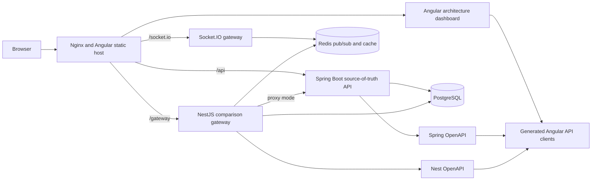
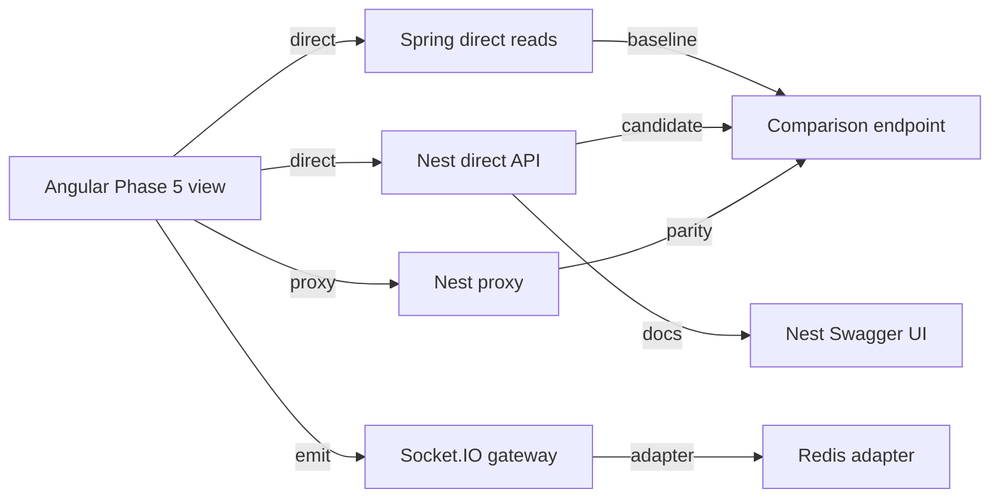

# 01 System Architecture

## Big Picture

The system is a Docker-first Nx architecture lab. A single browser entrypoint serves the Angular dashboard through Nginx. Nginx routes API calls to Spring Boot or NestJS. Spring Boot owns the source-of-truth API and durable writes. NestJS provides alternate direct reads, proxy reads through Spring, comparison diagnostics, and realtime events. PostgreSQL stores durable data. Redis supports transient pub/sub and short TTL cache demonstrations.

## Primary Responsibilities

| Component | Responsibility |
| --- | --- |
| Angular | Educational visualization shell, persona selector, dashboard, inspectors, comparison labs. |
| Nginx | Single browser entrypoint, static Angular host, reverse proxy for API and docs paths. |
| Spring Boot | Source-of-truth API, business writes, DTO contracts, Flyway execution, persona JWT cookies. |
| NestJS | Gateway, direct read comparison, proxy comparison, Socket.IO realtime, diagnostics. |
| PostgreSQL | Durable persistence for auth, loans, documents, events, metrics, and contract snapshots. |
| Redis | Transient pub/sub, Socket.IO scaling pattern, short TTL cache, cache hit/miss visualization. |
| pgAdmin | Database inspection for learners. |
| Redis Insight | Redis inspection for learners. |

## Source Of Truth Rule

Spring Boot is the source of truth for v1. It owns business writes such as loan status changes. It exposes DTOs through controllers, and those DTOs generate the official Spring OpenAPI contract.

NestJS may read directly from PostgreSQL for comparison and diagnostics, and it may proxy calls to Spring Boot. In v1, NestJS should not own durable business writes. This keeps the lab understandable:

- One backend owns business rules.
- One backend teaches gateway and realtime patterns.
- The frontend can compare all request paths.

## Browser-Facing URLs

| URL | Target |
| --- | --- |
| `/` | Angular dashboard served by Nginx |
| `/api` | Spring Boot API |
| `/gateway` | NestJS REST API |
| `/socket.io` | NestJS Socket.IO gateway |
| `/swagger/spring` | Spring Swagger UI |
| `/swagger/nest` | Nest Swagger UI |
| `/pgadmin` | pgAdmin, proxied through Nginx |
| `/redis-insight` | Redis Insight, proxied through Nginx |

## Backend Modes

| Mode | Path |
| --- | --- |
| Spring Boot direct | Angular -> Nginx -> Spring Boot -> PostgreSQL |
| NestJS direct | Angular -> Nginx -> NestJS -> PostgreSQL |
| NestJS proxy | Angular -> Nginx -> NestJS -> Spring Boot -> PostgreSQL |
| Compare all | Angular fires all comparison paths and renders metrics |
| Realtime | Angular -> Socket.IO -> NestJS -> Redis -> Angular update |

## Phase 5 Visualization Surface

Phase 5 makes backend topology visible before the full Nest implementation is complete. The `/lab/backend-comparison` route is the initial control surface:

The methodology is deliberate:

- D3/SVG renders topology and, later, active request/event paths.
- PrimeNG renders deliverables, acceptance criteria, role access, comparison metrics, and realtime event history.
- The current persona filters visible Phase 5 deliverables while the access matrix explains the complete intended permission model.
- Static visualization data should be replaced by live backend data through typed ViewModels, not by a separate UI.

## What This Teaches

- Architecture is easier to understand when each service has a clear job.
- A gateway can add value without owning all business rules.
- Comparison paths make tradeoffs visible instead of theoretical.
- A single browser entrypoint keeps the learner focused on architecture instead of ports.
- Role-aware visualization keeps diagnostics and realtime controls understandable without broadening access to every learner persona.
