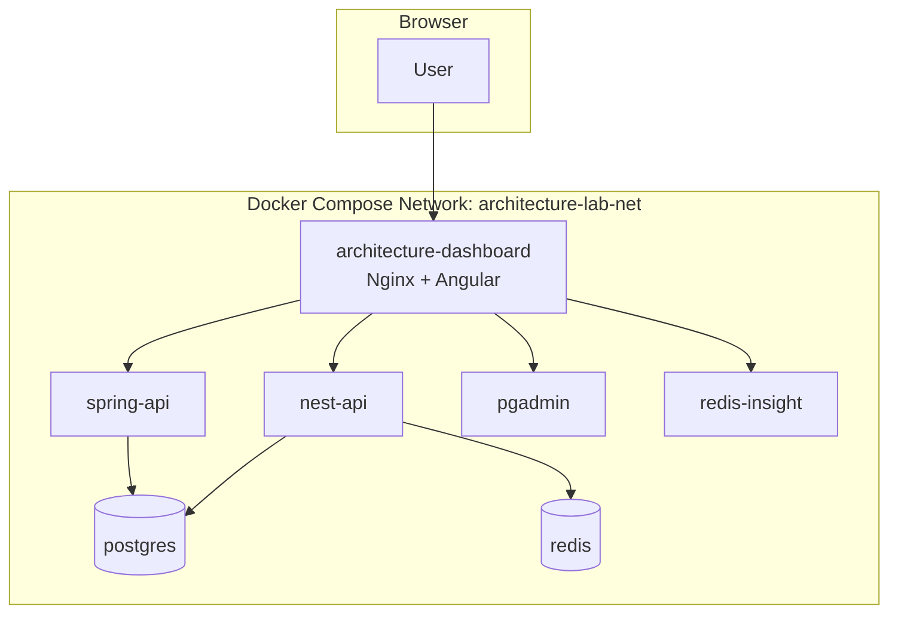
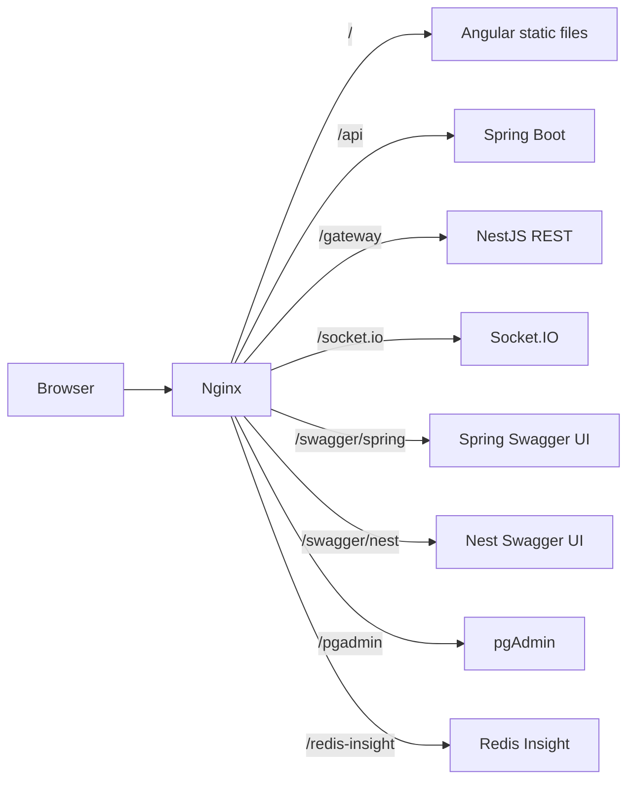

# 03 Docker Runtime Plan

## Docker-First Rule

The primary runtime target is Docker Compose. The normal command goal is:

```bash
docker compose up --build
```

Local non-Docker development can be added later as a convenience, but it should not become the main path in v1.

## Container List

| Service | Purpose |
| --- | --- |
| `architecture-dashboard` | Nginx container serving Angular and proxying browser-facing paths. |
| `spring-api` | Spring Boot source-of-truth API. |
| `nest-api` | NestJS comparison API, gateway, diagnostics, Socket.IO. |
| `postgres` | Durable database. |
| `redis` | Pub/sub, Socket.IO adapter support, short TTL cache. |
| `redis-insight` | Redis inspection UI. |
| `pgadmin` | PostgreSQL inspection UI. |



## Health Checks

| Service | Health signal |
| --- | --- |
| `postgres` | `pg_isready` succeeds. |
| `redis` | `redis-cli ping` returns `PONG`. |
| `spring-api` | `/actuator/health` returns healthy. |
| `nest-api` | `/gateway/health` returns healthy. |
| `architecture-dashboard` | Nginx responds on `/`. |
| `pgadmin` | Container reports healthy or HTTP responds. |
| `redis-insight` | Container reports healthy or HTTP responds. |

## Dependency Order

1. PostgreSQL and Redis start first.
2. Spring Boot waits for PostgreSQL, then runs Flyway migrations.
3. NestJS waits for PostgreSQL, Redis, and Spring Boot health.
4. Angular/Nginx starts after the API services are available enough for routing.
5. Inspection tools may start independently after their backing services exist.

## Nginx Routing

The route skeleton lives at `apps/architecture-dashboard/nginx/default.conf`. It is checked in before the dashboard container is converted from Angular dev-server mode to production Nginx static hosting.



## What This Teaches

- Compose keeps service ownership visible.
- Health checks prevent confusing startup races.
- Nginx makes the browser path consistent.
- Inspection tools are part of the learning experience, not hidden admin extras.
