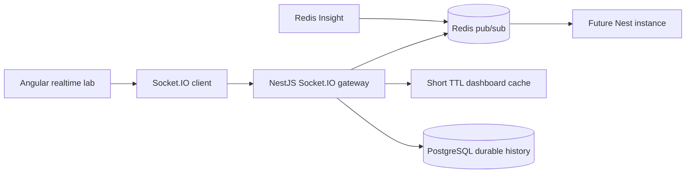

# 05 Redis Realtime And Cache Plan

## Purpose

Redis is included as a Docker container for a specific educational purpose. It supports transient coordination, Socket.IO scaling patterns, short TTL dashboard summary caching, cache hit/miss visualization, and Redis Insight inspection.

Redis is not the durable source of truth. PostgreSQL stores durable loan records and status history.

## Redis Responsibilities

| Responsibility | Description |
| --- | --- |
| Socket.IO pub/sub | Demonstrates how events could fan out across multiple Nest instances. |
| Short TTL cache | Stores dashboard summary responses for a short time. |
| Cache hit/miss visualization | Shows when a dashboard read is served from cache. |
| Realtime coordination | Helps explain event propagation separate from durable storage. |
| Redis Insight | Lets learners inspect keys, TTLs, and activity. |

## Redis Non-Responsibilities

Redis should not store authoritative loan state in v1. It should not replace PostgreSQL for durable status history. It should not become a hidden dependency for basic dashboard reads unless the cache behavior is explicitly visible.

## Example Cache Keys

| Key | TTL | Meaning |
| --- | ---: | --- |
| `dashboard:snapshot:small` | 30 seconds | Cached small dashboard summary. |
| `dashboard:snapshot:medium` | 30 seconds | Cached medium dashboard summary. |
| `metrics:backend-comparison:last` | 60 seconds | Last comparison metrics. |
| `socket:events:last` | 10 seconds | Last emitted realtime event preview. |

## What This Teaches

- Cache is a performance tool, not a data ownership model.
- Pub/sub is coordination, not durable event storage.
- Redis Insight makes transient infrastructure inspectable.
- Socket.IO plus Redis prepares the system for horizontal scaling lessons later.

