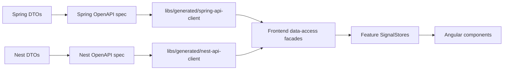

# 08 OpenAPI Contract Generation

## Purpose

OpenAPI prevents API/frontend drift. The browser should not rely on hand-written TypeScript models that slowly diverge from backend DTOs.



## Generated Client Rule

Generated files are not manually edited. If generated code is wrong, fix the backend DTO or generator configuration, then regenerate.

Components do not inject generated services directly. The dependency direction is:

```text
Component
  -> Feature SignalStore
    -> Data-access facade
      -> Generated OpenAPI service
```

## Drift Boundaries

| Drift type | Protection |
| --- | --- |
| Database schema drift | Flyway migrations |
| API/frontend drift | OpenAPI generation |
| Frontend mapping drift | ViewModel tests |
| Runtime behavior drift | Playwright E2E |

## Generated Library Structure

```text
libs/generated/
  spring-api-client/
    project.json
    src/
      generated/
  nest-api-client/
    project.json
    src/
      generated/
```

Current checkpoint: `spring-api-client` and `nest-api-client` exist as Nx-discoverable libraries. The Spring client is generated and wrapped by Angular facades for current persona/dashboard calls. The Nest client remains planned until the gateway OpenAPI document is implemented.

Phase 5 implication: generated Nest models should include comparison metric rows and realtime event DTOs with stable ids (`pathId`, `eventId`) so the D3 graph and PrimeNG tables can bind to contract-backed data.

Priority note: OpenAPI generation should move ahead of broad additional visualization work. The enterprise pattern to reinforce is:

```text
Spring OpenAPI -> generated Angular client -> facade -> store -> PrimeNG view
```

The Security Search screen currently uses a deterministic local facade with `SecuritySearchRowVm`. It should become an explicit consumer of facade-wrapped generated DTOs once the security/pool/commitment/disclosure API shape exists.

## What This Teaches

- Contracts should be generated from real endpoint DTOs.
- Generated clients reduce duplicate model maintenance.
- Data-access facades keep generated code from leaking into component design.
- Contract generation does not replace database migrations.
