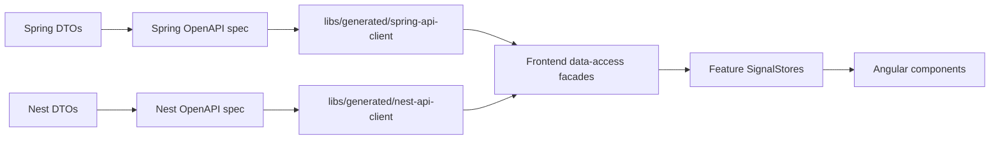

# 08 OpenAPI Contract Generation

## Purpose

OpenAPI prevents API/frontend drift. The browser should not rely on hand-written TypeScript models that slowly diverge from backend DTOs.



## Generated Client Rule

Generated files are not manually edited. If generated code is wrong, fix the backend DTO or generator configuration, then regenerate.

Components do not inject generated services directly. The dependency direction is:

```text
Component
  -> Feature SignalStore
    -> Data-access facade
      -> Generated OpenAPI service
```

## Drift Boundaries

| Drift type | Protection |
| --- | --- |
| Database schema drift | Flyway migrations |
| API/frontend drift | OpenAPI generation |
| Frontend mapping drift | ViewModel tests |
| Runtime behavior drift | Playwright E2E |

## Critical Contract Gap Alerts

Generated DTOs are treated as raw contract data. Facades validate critical fields before data reaches stores or page views:

| Surface | Facade validator | Critical fields |
| --- | --- | --- |
| Spring dashboard snapshot | `SpringApiFacade.validateDashboardSnapshot` | `dataset`, `loans[]`, `loan.id`, `borrowerId`, `loanNumber`, positive `amount`, `statusCode` |
| Nest comparison metrics | `NestApiFacade.validateComparisonResponse` | `subject`, `observedAt`, `pathId`, `label`, `status`, non-negative metric counters |
| Nest realtime events | `NestApiFacade.validateRealtimeEventHistory` | `eventId`, `type`, `loanId`, `loanNumber`, status transition fields, `source`, `observedAt` |

The OpenAPI Contract Lab exposes these as contract gap alerts. Future securities, commitments, disclosures, and pricing DTOs should add equivalent facade validators when their generated APIs are introduced.

## Generated Library Structure

```text
libs/generated/
  spring-api-client/
    project.json
    src/
      generated/
  nest-api-client/
    project.json
    src/
      generated/
```

Current checkpoint: `spring-api-client` and `nest-api-client` are Nx-discoverable generated libraries. The Spring client is generated from `/v3/api-docs` and wrapped by `SpringApiFacade` for persona, auth, and dashboard calls. The Nest client is generated from a local exported Swagger document and wrapped by `NestApiFacade` for comparison metrics, direct reads, proxy reads, realtime history, and realtime emit calls.

Phase 6 checkpoint: generated Nest models include comparison metric rows and realtime event DTOs with stable ids (`pathId`, `eventId`) so the D3 graph and PrimeNG tables can bind to contract-backed data.

Priority note: OpenAPI generation should move ahead of broad additional visualization work. The enterprise pattern to reinforce is:

```text
Spring OpenAPI -> generated Angular client -> facade -> store -> PrimeNG view
```

The Security Search screen currently uses a deterministic local facade with `SecuritySearchRowVm`. It should become an explicit consumer of facade-wrapped generated DTOs once the security/pool/commitment/disclosure API shape exists.

Useful commands:

```text
pnpm nx run spring-api-client:generate
pnpm nx run nest-api-client:generate
pnpm run check:openapi-clients
```

## What This Teaches

- Contracts should be generated from real endpoint DTOs.
- Generated clients reduce duplicate model maintenance.
- Data-access facades keep generated code from leaking into component design.
- Contract generation does not replace database migrations.
