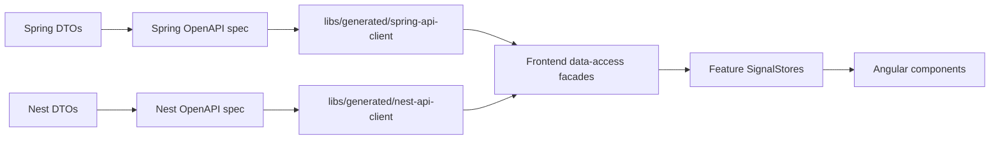

# 08 OpenAPI Contract Generation

## Purpose

OpenAPI prevents API/frontend drift. The browser should not rely on hand-written TypeScript models that slowly diverge from backend DTOs.



## Generated Client Rule

Generated files are not manually edited. If generated code is wrong, fix the backend DTO or generator configuration, then regenerate.

Components do not inject generated services directly. The dependency direction is:

```text
Component
  -> Feature SignalStore
    -> Data-access facade
      -> Generated OpenAPI service
```

## Drift Boundaries

| Drift type | Protection |
| --- | --- |
| Database schema drift | Flyway migrations |
| API/frontend drift | OpenAPI generation |
| Frontend mapping drift | ViewModel tests |
| Runtime behavior drift | Playwright E2E |

## Generated Library Structure

```text
libs/generated/
  spring-api-client/
    project.json
    src/
      models/
      services/
  nest-api-client/
    project.json
    src/
      models/
      services/
```

Current checkpoint: `spring-api-client` and `nest-api-client` exist as Nx-discoverable placeholder libraries. They contain only placeholder exports until Spring and Nest OpenAPI documents exist and generation is wired.

## What This Teaches

- Contracts should be generated from real endpoint DTOs.
- Generated clients reduce duplicate model maintenance.
- Data-access facades keep generated code from leaking into component design.
- Contract generation does not replace database migrations.
