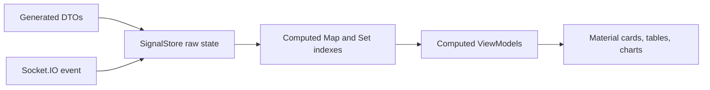

# 10 NgRx SignalStore State Plan

## Purpose

NgRx SignalStore is the frontend state layer. It should hold raw DTO state, expose computed indexes, project ViewModels, and apply realtime events with copy-on-write updates.

## Primary Stores

| Store | Purpose |
| --- | --- |
| `AuthStore` | Persona, current user, permission set. |
| `DashboardStore` | Raw dashboard DTOs, selected backend, dataset size, computed dashboard ViewModels. |
| `BackendComparisonStore` | Comparison mode, metrics, errors, response summaries. |
| `RealtimeStore` | Socket connection, event history, event controls, last realtime event. |
| `OpenApiContractStore` | Contract summaries, generated client status, drift check state. |
| `McpDashboardStore` | MCP guidance checklist and command references. |
| `ExplainModeStore` | Global Explain Mode state and overlays. |

## State Examples

```ts
type DashboardState = {
  selectedPersonaId: string | null;
  selectedBackendMode: BackendMode;
  selectedDatasetSize: DatasetSize;
  explainMode: boolean;
  loansById: Map<string, LoanDto>;
  borrowers: BorrowerDto[];
  documents: LoanDocumentDto[];
  statusCodes: LoanStatusCodeDto[];
  lastRealtimeEvent: LoanStatusEventDto | null;
  comparisonResults: BackendComparisonResultDto[];
};
```

## Computed State Examples

| Computed signal | Purpose |
| --- | --- |
| `permissionSet` | Fast permission membership checks. |
| `visibleNavItems` | Route navigation filtered by permissions. |
| `borrowersById` | Borrower lookup by id. |
| `documentsByLoanId` | Grouped documents for loan cards. |
| `statusByCode` | Status metadata lookup. |
| `loanCards` | Card-ready dashboard ViewModels. |
| `dashboardSummary` | Totals and chart data. |
| `mapInspectorRows` | Rows explaining current Map contents. |
| `signalStoreGraph` | D3-ready SignalStore dependency graph. |



## What This Teaches

- Raw DTOs are not the same thing as UI state.
- Computed signals make derived state explicit.
- Map indexes make joins visible and efficient.
- Realtime events should update state immutably.

