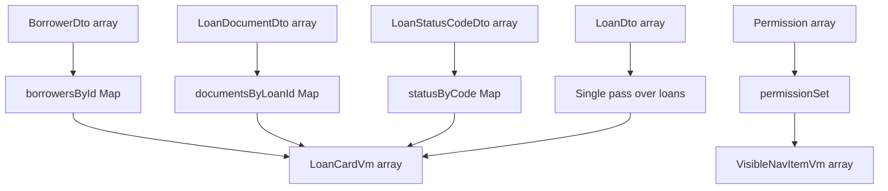

# 11 Mapping, Map, Set, And ViewModel Patterns

## Purpose

This lab makes common JavaScript and Angular data transformation concepts visible:

- `Array.map` transforms array items.
- RxJS `map` transforms Observable emissions.
- `Map` stores keyed lookup/index data.
- `Set` stores fast membership checks.
- `computed` derives signal state from other signal state.

## Core Indexes

| Index | Type | Purpose |
| --- | --- | --- |
| `loansById` | `Map<string, LoanDto>` | Find a loan quickly by id. |
| `borrowersById` | `Map<string, BorrowerDto>` | Join loan rows to borrower details. |
| `documentsByLoanId` | `Map<string, LoanDocumentDto[]>` | Group documents under each loan. |
| `statusByCode` | `Map<string, LoanStatusCodeDto>` | Attach labels, colors, and descriptions to status codes. |
| `permissionSet` | `Set<string>` | Check feature visibility and action authorization. |

## Complexity Comparison

Nested `find` and `filter` joins can become expensive:

```text
loans.map(loan => borrowers.find(b => b.id === loan.borrowerId))
```

That pattern can drift toward `O(n x m)` work.

The Map approach builds indexes once and then performs direct lookup:

```text
borrowersById = new Map(borrowers.map(b => [b.id, b]))
loanCards = loans.map(loan => buildCard(loan, borrowersById.get(loan.borrowerId)))
```

That pattern is closer to `O(n + m)`.



## Main ViewModels

| ViewModel | Purpose |
| --- | --- |
| `PersonaCardVm` | Persona selector card. |
| `VisibleNavItemVm` | Permission-filtered nav item. |
| `LoanCardVm` | Dashboard card display. |
| `LoanTableRowVm` | PrimeNG table row display. |
| `DashboardSummaryVm` | KPI and chart summary. |
| `MapInspectorRowVm` | Map inspector table row. |
| `SignalStoreNodeVm` | D3 SignalStore graph node. |
| `BackendComparisonVm` | Backend comparison chart/table display. |
| `RealtimeEventVm` | Realtime event history row. |
| `OpenApiContractVm` | Contract lab display node. |
| `McpDashboardVm` | MCP guidance checklist display. |

## What This Teaches

- The word "map" can mean different things depending on context.
- Keyed lookup is often clearer than repeated nested searching.
- ViewModels keep components simple.
- Performance lessons become visible when dataset size changes.

