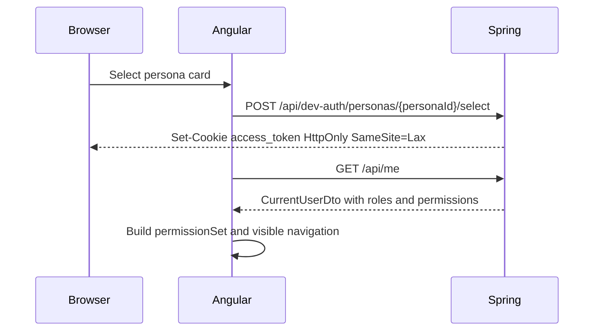

# 12 Auth Persona And HttpOnly Cookie Plan

## Purpose

The lab uses persona selection instead of a login form. This keeps the focus on architecture while still teaching browser auth patterns, permissions, route guards, and secure token handling.

## Persona Style

Use both realistic names and role labels:

| Persona | Role label |
| --- | --- |
| Alice Viewer | Viewer |
| Ben Reviewer | Reviewer |
| Cara Approver | Approver |
| Diana Admin | Admin |
| Ethan Diagnostics Admin | Diagnostics Admin |
| Fiona Contract Admin | Contract Admin |
| Grace Realtime Operator | Realtime Operator |
| Henry MCP Explorer | MCP Explorer |
| Irene Document Reviewer | Reviewer |
| Jason Auditor | Auditor |
| Morgan Platform Admin | Admin |
| Nora Security Admin | Admin |
| Owen API Admin | Contract Admin |

## Core Roles

- Viewer
- Reviewer
- Approver
- Admin
- Diagnostics Admin
- Contract Admin
- Realtime Operator
- MCP Explorer
- Auditor

## Core Permissions

| Permission | Meaning |
| --- | --- |
| `dashboard:view` | Open dashboard views. |
| `loans:view` | View loan records. |
| `loans:update` | Update loan status. |
| `documents:view` | View document metadata. |
| `documents:update` | Update document metadata. |
| `admin:view` | View admin lab. |
| `diagnostics:view` | View diagnostics panels. |
| `contracts:view` | View OpenAPI contract lab. |
| `developer:view` | View developer-only lab pages, including glossary and theme governance. |
| `mcp:view` | View MCP dashboard. |
| `realtime:view` | View realtime lab. |
| `realtime:emit` | Trigger demo realtime events. |
| `backend-comparison:view` | View backend comparison lab. |

## Explicit Seeded Role Assignments

Sidebar navigation is permission-driven only. The frontend should not carry a second role/persona assignment model. If a role should see a sidebar link, assign the corresponding permission in seed data.

| Role id | Personas | Seeded permissions | Sidebar links unlocked |
| --- | --- | --- | --- |
| `viewer` | Alice Viewer | `dashboard:view`, `loans:view` | Dashboard, Architecture Flow, Map Inspector, Security Search, Capital Markets |
| `reviewer` | Ben Reviewer, Irene Document Reviewer | `dashboard:view`, `loans:view`, `documents:view` | Dashboard, Architecture Flow, Map Inspector, Security Search, Capital Markets |
| `approver` | Cara Approver | `dashboard:view`, `loans:view`, `loans:update` | Dashboard, Architecture Flow, Map Inspector, Security Search, Capital Markets |
| `admin` | Diana Admin, Morgan Platform Admin, Nora Security Admin | `dashboard:view`, `loans:view`, `loans:update`, `documents:view`, `documents:update`, `admin:view`, `contracts:view`, `diagnostics:view`, `backend-comparison:view`, `realtime:view`, `developer:view`, `mcp:view` | Admin, OpenAPI, diagnostics, backend comparison, realtime, MCP, glossary, theme governance, and core learner links |
| `diagnostics-admin` | Ethan Diagnostics Admin | `dashboard:view`, `diagnostics:view`, `backend-comparison:view` | Dashboard, Architecture Flow, Map Inspector, SignalStore Inspector, Infrastructure, Backend Comparison, Metrics History |
| `contract-admin` | Fiona Contract Admin, Owen API Admin | `dashboard:view`, `contracts:view` | Dashboard, Architecture Flow, Map Inspector, OpenAPI |
| `realtime-operator` | Grace Realtime Operator | `dashboard:view`, `realtime:view`, `realtime:emit` | Dashboard, Architecture Flow, Map Inspector, Backend Comparison, Realtime Lab |
| `mcp-explorer` | Henry MCP Explorer | `dashboard:view`, `developer:view`, `mcp:view` | Dashboard, Architecture Flow, Map Inspector, MCP Dashboard, Glossary, Theme Governance |
| `auditor` | Jason Auditor | `dashboard:view`, `loans:view`, `documents:view` | Dashboard, Architecture Flow, Map Inspector, Security Search, Capital Markets |

## Phase 5 Access Matrix

| Role | Phase 5 access |
| --- | --- |
| Diagnostics Admin | Backend comparison, diagnostics panels, direct/proxy comparison inspection. |
| Realtime Operator | Realtime lab and demo event emission. |
| Contract Admin | OpenAPI contract lab and Nest Swagger inspection. |
| Admin | Admin/persona lab; no comparison or realtime access unless explicitly granted. |
| Viewer, Reviewer, Approver, Auditor, MCP Explorer | No Phase 5 comparison/realtime controls by default. |

This split is intentional. The UI should show a role matrix so users understand that hidden Phase 5 controls are permission-driven, not missing features.

## Cookie Flow

Current implementation checkpoint: the landing page loads persona cards from Spring, posts the selected persona to `/api/dev-auth/personas/{personaId}/select`, receives an httpOnly cookie, then calls `/api/me`. `/lab` is guarded by `/api/me`, but the backend currently falls back to Alice Viewer when no cookie exists so the lab remains demo-accessible during setup.

## Security Notes

Angular cannot read the cookie. The browser sends it automatically. This demonstrates why httpOnly cookies reduce token exposure to browser JavaScript.

Current implementation: `access_token` is an HMAC-signed demo persona token shared by Spring and Nest through `DEV_AUTH_SECRET`. Replace the demo persona selector with a signed JWT from an external IdP or an opaque server session before treating the flow as production-like auth.

CSRF must be discussed because cookies are automatically attached by the browser. For v1, use `SameSite=Lax` and keep state-changing endpoints explicit. A later hardening phase can add CSRF tokens for production-like behavior.

Persona selection is demo-only and must be disabled outside the Docker demo profile.

## What This Teaches

- Authentication and authorization are separate concepts.
- Frontend permission checks improve UX but do not replace backend enforcement.
- httpOnly cookies protect tokens from direct JavaScript reads.
- Demo shortcuts must be profile-gated.
- Route-level guards should mirror sidebar filtering for protected lab routes.
