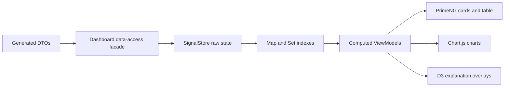

# 14 Dashboard Feature Plan

## Purpose

The dashboard is the primary working surface. It shows loan cards, loan tables, filters, status chips, charts, dataset controls, backend mode selection, and Explain Mode overlays.

## Dashboard Capabilities

| Capability | Description |
| --- | --- |
| Loan cards | Compact cards with borrower, amount, status, document count, risk band. |
| Loan table | PrimeNG table with sorting, filtering, and status chips. |
| Dataset selector | Small, Medium, Large, Stress. |
| Backend selector | Spring direct, Nest direct, Nest proxy, Compare all. |
| Credit score bands | Visual grouping for borrower risk. |
| Document counts | Joined from `documentsByLoanId`. |
| Approval state | Derived from status code and permissions. |
| Explain overlays | Show DTO, Map, computed, and UI projection path. |

## Data Flow

Current checkpoint: Angular calls Spring `/api/dashboard/snapshot?dataset=small`, stores the DTO in `DashboardStore`, builds computed `Map` indexes, and renders the first loan cards, loan table, and Map Inspector. Dataset sizes beyond Small and Chart.js summaries are still planned.

## Dashboard ViewModels

| ViewModel | Inputs |
| --- | --- |
| `LoanCardVm` | Loan, borrower, status, documents, permission set. |
| `LoanTableRowVm` | Loan, borrower, status, document count. |
| `DashboardSummaryVm` | Loans, statuses, backend metrics. |
| `MapInspectorRowVm` | Current index state. |

## What This Teaches

- The UI should not render raw DTOs directly.
- One snapshot can feed multiple UI projections.
- Dataset size controls make performance and mapping choices visible.
- Explain Mode should attach learning to real UI behavior.
