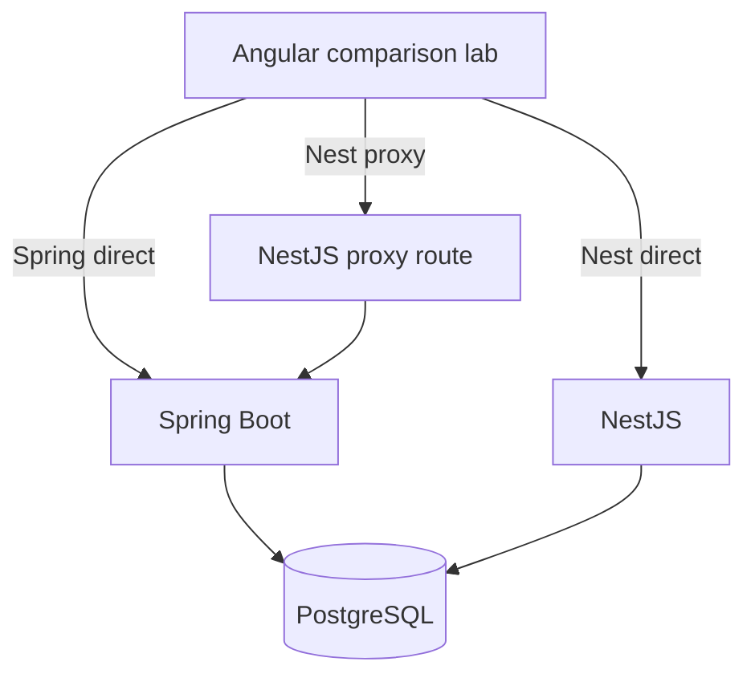

# 15 Backend Comparison Lab

## Purpose

The backend comparison lab makes request path tradeoffs measurable. It compares Spring Boot direct, NestJS direct to PostgreSQL, and NestJS proxy to Spring Boot.

## Modes

## Metrics

| Metric | Meaning |
| --- | --- |
| Latency | End-to-end request time observed by Angular. |
| Payload size | Response byte size. |
| Record count | Number of domain records returned. |
| Query time | Backend-reported database query duration when available. |
| Serialization time | Backend-reported DTO serialization duration when available. |
| Contract compatibility | Whether payload shape matches expected contract. |
| Error state | Failure mode, status code, and message. |

## Expected UI

- Segmented backend mode control driven by the landing page dashboard selector.
- Compare-all button.
- D3 topology view showing Spring direct, Nest direct, Nest proxy, comparison endpoint, Socket.IO, Redis, and Swagger context.

The landing page should explicitly set Phase 5 mode to one of the backend paths: Spring direct, Nest direct, Nest proxy, or Compare all. This makes the Phase 5 plan cover both the Java Spring source-of-truth API and the Nest gateway/read comparison modes.
- PrimeNG deliverables and acceptance criteria tables during implementation.
- PrimeNG role/persona access matrix so restricted routes are explainable.
- Latency chart.
- Payload size chart.
- Contract compatibility table.
- Error panel.
- Explain Mode request path overlay.

## Visualization Methodology

The comparison lab should evolve in layers:

1. Static topology and access matrix. This explains the planned architecture and verifies role-aware route access.
2. Live comparison summary. The comparison endpoint should populate rows for Spring direct, Nest direct, and Nest proxy with latency, payload size, record count, and error state.
3. Request path highlighting. The D3 graph should highlight the path that produced the selected metric row.
4. Trend charts. Chart.js should show latency and payload history once repeated comparison runs are available.
5. Explain Mode overlays. Overlays should call out why proxy reads are flexible, why direct reads can be fast, and why Spring remains the durable source of truth.

The first implementation already uses D3 for topology and PrimeNG for tables. Future backend work should feed the same ViewModel shape rather than creating a separate comparison UI.

Runtime acceptance for the live comparison layer:

- Spring direct, Nest direct, and Nest proxy must be comparable in the same topology view.
- The comparison endpoint must expose live metrics for all three paths.
- Comparison metrics must update PrimeNG status tables and D3 request path state.
- Local dev validation must confirm Angular proxy traffic reaches Spring through `localhost:18080`.
- Docker validation must confirm compose uses `SPRING_API_TARGET=http://spring-api:8080`.

## What This Teaches

- Architectural tradeoffs should be measured.
- Proxy paths add flexibility and overhead.
- Direct database reads can be fast but may bypass business ownership.
- Contract compatibility matters as much as response speed.
- Role-aware visibility matters because diagnostics and realtime controls are intentionally not general learner permissions.
