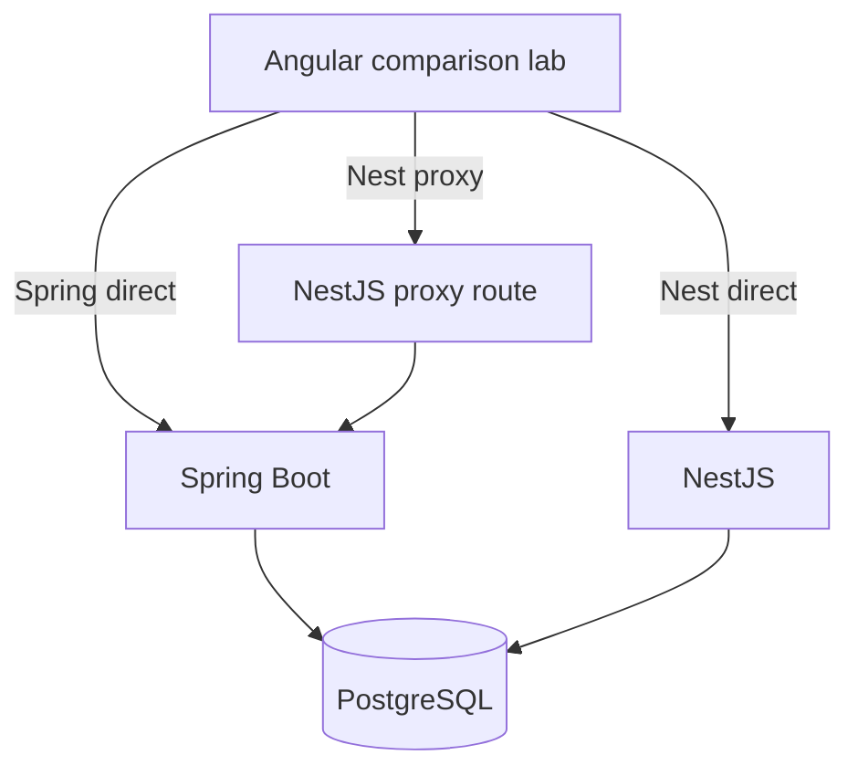

# 15 Backend Comparison Lab

## Purpose

The backend comparison lab makes request path tradeoffs measurable. It compares Spring Boot direct, NestJS direct to PostgreSQL, and NestJS proxy to Spring Boot.

## Modes

## Metrics

| Metric | Meaning |
| --- | --- |
| Latency | End-to-end request time observed by Angular. |
| Payload size | Response byte size. |
| Record count | Number of domain records returned. |
| Query time | Backend-reported database query duration when available. |
| Serialization time | Backend-reported DTO serialization duration when available. |
| Contract compatibility | Whether payload shape matches expected contract. |
| Error state | Failure mode, status code, and message. |

## Expected UI

- Segmented backend mode control.
- Compare-all button.
- Latency chart.
- Payload size chart.
- Contract compatibility table.
- Error panel.
- Explain Mode request path overlay.

## What This Teaches

- Architectural tradeoffs should be measured.
- Proxy paths add flexibility and overhead.
- Direct database reads can be fast but may bypass business ownership.
- Contract compatibility matters as much as response speed.

