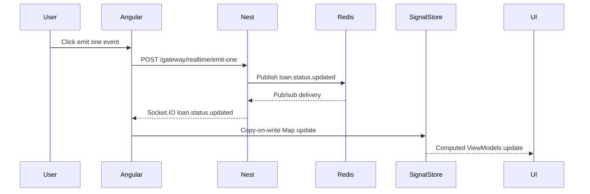

# 16 Realtime Socket.IO And Redis Lab

## Purpose

The realtime lab shows how an event travels from NestJS through Socket.IO, optionally through Redis pub/sub, into Angular SignalStore state, and finally into cards, tables, and charts.

## Flow



## Controls

| Control | Purpose |
| --- | --- |
| Emit one event | Demonstrate one loan status update. |
| Emit burst | Demonstrate multiple events and throughput. |
| Pause | Stop applying events while still showing queue behavior. |
| Resume | Apply queued events. |
| Reset | Restore demo baseline. |

## State Update Rule

Use copy-on-write updates for Map state:

```ts
const nextLoansById = new Map(currentLoansById);
nextLoansById.set(event.loanId, updatedLoan);
```

This keeps signal dependency tracking predictable.

## What This Teaches

- Realtime events can patch client state without full reloads.
- Redis pub/sub coordinates event delivery but does not store durable history.
- SignalStore computed state can update cards, tables, and charts together.
- Burst controls make throughput and UI recomputation visible.

