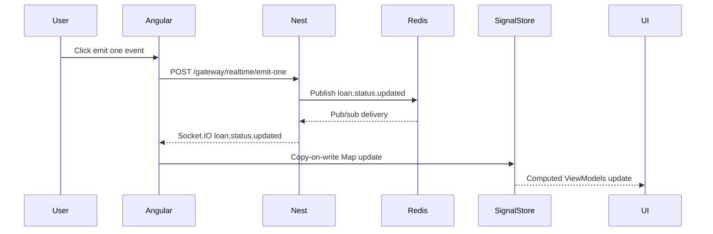

# 16 Realtime Socket.IO And Redis Lab

## Purpose

The realtime lab shows how an event travels from NestJS through Socket.IO, optionally through Redis pub/sub, into Angular SignalStore state, and finally into cards, tables, and charts.

## Flow



## Controls

| Control | Purpose |
| --- | --- |
| Emit one event | Demonstrate one loan status update. |
| Emit burst | Demonstrate multiple events and throughput. |
| Pause | Stop applying events while still showing queue behavior. |
| Resume | Apply queued events. |
| Reset | Restore demo baseline. |

## Phase 5 Visualization Methodology

Realtime starts as part of the Phase 5 topology view, then becomes interactive when the Socket.IO client and emit endpoint are wired.

The Phase 5 view should show:

- Socket.IO gateway as a D3 node connected to Angular.
- Redis adapter as a D3 node connected to Socket.IO.
- Realtime Operator access in the role/persona matrix.
- `realtime:view` and `realtime:emit` as separate permissions.

When live realtime work begins, add PrimeNG event history rows before adding more decorative animation. Each emitted event should have a stable event id, loan id, old status, new status, timestamp, delivery state, and error state. The D3 graph can then highlight `Angular -> Socket.IO -> Redis -> Angular` for the selected event.

Runtime acceptance for the live realtime layer:

- A Socket.IO gateway endpoint emits realtime event messages.
- Emitted messages update the Phase 5 visualization.
- Socket.IO event history updates the realtime portion of the Phase 5 view.
- Event history rows should use the same event id returned by the emit endpoint.

Keep the methodology consistent with backend comparison:

- D3 explains topology and active paths.
- PrimeNG explains event history, permissions, and operational status.
- Signal state receives copy-on-write updates so cards, tables, and charts update from the same source.

## State Update Rule

Use copy-on-write updates for Map state:

```ts
const nextLoansById = new Map(currentLoansById);
nextLoansById.set(event.loanId, updatedLoan);
```

This keeps signal dependency tracking predictable.

## What This Teaches

- Realtime events can patch client state without full reloads.
- Redis pub/sub coordinates event delivery but does not store durable history.
- SignalStore computed state can update cards, tables, and charts together.
- Burst controls make throughput and UI recomputation visible.
