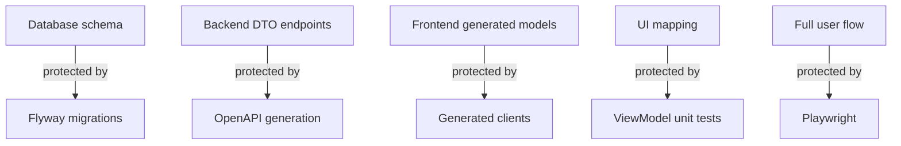

# 17 OpenAPI Contract Lab

## Purpose

The OpenAPI contract lab teaches anti-drift workflows. It shows Spring Swagger UI, Nest Swagger UI, generated client status, DTO lists, endpoint lists, contract snapshots, and drift checks.

## Panels

| Panel | Purpose |
| --- | --- |
| Spring Swagger UI | Inspect source-of-truth API contract. |
| Nest Swagger UI | Inspect gateway/comparison contract. |
| Generated client status | Show generation timestamp and source spec. |
| Contract tree | D3 view of endpoints, DTOs, and generated models. |
| DTO list | Compare major DTOs across services. |
| Endpoint list | Show browser-facing paths. |
| Drift explanation | Explain database, API, frontend mapping, and runtime drift. |

## Phase 5 Relationship

The Phase 5 view includes Nest Swagger UI as a topology node and shows Contract Admin access in the role matrix. The OpenAPI Contract Lab remains the deeper contract surface, but Phase 5 should expose enough Swagger/contract status to explain why gateway DTOs matter for comparison metrics and realtime events.

Nest contract DTOs should include:

- comparison metric rows keyed by `pathId`
- realtime emit responses keyed by `eventId`
- Socket.IO event payload shape
- diagnostics and Redis adapter status summaries

## Drift Map

## Key Rule

Generated files are build artifacts. They should be regenerated, not hand-edited.

## What This Teaches

- Contract drift is a workflow problem, not just a code problem.
- Swagger UI is useful for humans; generated clients are useful for code.
- Nest can expose a useful contract even when Spring owns source-of-truth writes.
- Tests complete the contract story by verifying UI behavior.
- Phase 5 should consume contract-backed shapes once the Nest OpenAPI document exists.
