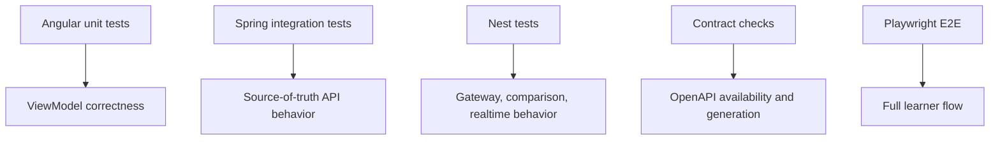

# 19 Testing Strategy

## Purpose

The test suite proves the lab works at multiple levels: transformation logic, state projection, backend behavior, realtime updates, contract availability, and full browser flows.

## Angular Tests

- Map joins
  - `borrowersById`
  - `documentsByLoanId`
  - `statusByCode`
- Set permissions
- Computed ViewModels
  - loan cards
  - security search rows
  - missing borrower/status fallback rows
- Persona selection state
- Visible nav filtering
- PrimeNG lazy table query-state projection
- Permission guard redirects for protected Phase 5 routes
- Phase 5 deliverable filtering by permission set
- Phase 5 graph ViewModel construction
- Backend selector state
- Realtime event patching
- Explain Mode projection

## Spring Integration Tests

- Flyway migration startup
- Persona cookie auth
- `/api/me`
- Loan endpoints
- Dashboard snapshot endpoint
- OpenAPI endpoint availability
- Admin permission checks

## Nest Tests

- Direct PostgreSQL read endpoint
- Proxy endpoint
- Comparison endpoint
- Comparison response includes stable `pathId` values for visualization binding
- Socket gateway event emission
- Realtime emit response and Socket.IO event share an `eventId`
- Redis cache hit/miss behavior
- Swagger document availability

## Playwright Tests

- Select persona
- Verify dropdowns display the full set of selections for persona, dataset size, and backend mode
- Verify selected dataset size and backend mode are preserved into dashboard state
- Open Security Search and verify lazy table loading, filters, sorting, row actions, detail dialog, loading state, and empty state
- Verify Diagnostics Admin can open `/lab/backend-comparison`
- Verify a non-diagnostics persona cannot open `/lab/backend-comparison` directly
- Toggle Explain Mode
- Select dataset size
- Select Spring backend
- Select Nest backend
- Compare all backend modes
- Open Map Inspector
- Trigger realtime event
- Verify card/table/chart update
- Verify admin-only panels
- Verify OpenAPI lab loads
- Verify local proxy path `/api/personas` returns the same persona list as Spring direct in local smoke workflows

## What This Teaches

- Unit tests protect mapping logic.
- Integration tests protect service contracts.
- E2E tests protect the workshop flow.
- Tests are part of the architecture, not an afterthought.
