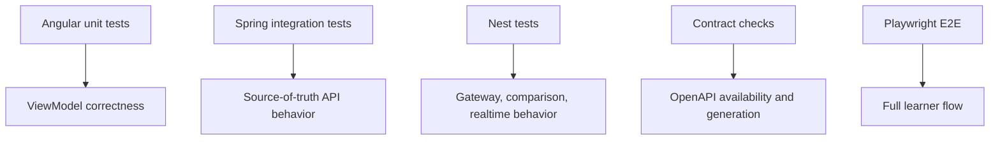

# 19 Testing Strategy

## Purpose

The test suite proves the lab works at multiple levels: transformation logic, state projection, backend behavior, realtime updates, contract availability, and full browser flows.

## Angular Tests

- Map joins
- Set permissions
- Computed ViewModels
- Persona selection state
- Backend selector state
- Realtime event patching
- Explain Mode projection

## Spring Integration Tests

- Flyway migration startup
- Persona cookie auth
- `/api/me`
- Loan endpoints
- Dashboard snapshot endpoint
- OpenAPI endpoint availability
- Admin permission checks

## Nest Tests

- Direct PostgreSQL read endpoint
- Proxy endpoint
- Comparison endpoint
- Socket gateway event emission
- Redis cache hit/miss behavior
- Swagger document availability

## Playwright Tests

- Select persona
- Toggle Explain Mode
- Select dataset size
- Select Spring backend
- Select Nest backend
- Compare all backend modes
- Open Map Inspector
- Trigger realtime event
- Verify card/table/chart update
- Verify admin-only panels
- Verify OpenAPI lab loads

## What This Teaches

- Unit tests protect mapping logic.
- Integration tests protect service contracts.
- E2E tests protect the workshop flow.
- Tests are part of the architecture, not an afterthought.

