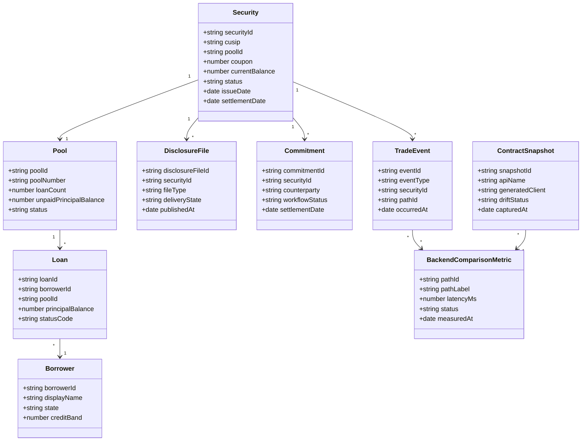
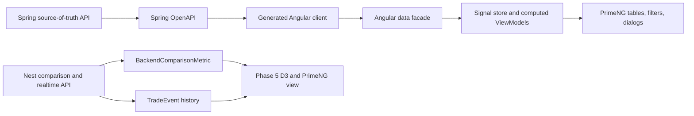

# 21 Capital Markets Vocabulary

## Purpose

This document locks the shared Capital Markets vocabulary for frontend ViewModels, backend DTOs, generated OpenAPI contracts, database seed data, PrimeNG screens, D3 topology labels, tests, and planning documents.

The goal is not to model a production trading, disclosure, or mortgage platform. The goal is to give the lab a consistent enterprise domain language that is realistic enough to make architecture choices visible.

## Core Concepts

| Concept | Meaning In This Lab | Primary UI Use | API Boundary |
| --- | --- | --- | --- |
| `Security` | A mortgage-backed security or study security row that groups pool, coupon, balance, status, and disclosure metadata. | Security search, disclosure inspection, comparison rows. | Spring source-of-truth DTO, Nest comparison DTO, generated Angular client model. |
| `Pool` | A grouped set of loans backing a security. | Pool dashboard, security detail dialog, disclosure metadata. | Spring source-of-truth DTO and security detail response. |
| `Loan` | A simplified loan record used as source material for pool and dashboard examples. | Dashboard cards, Map inspector, pool composition. | Existing Spring dashboard DTOs and future pool detail DTOs. |
| `Borrower` | A simplified borrower/person entity linked to loans. | Dashboard joins, fallback row tests, pool detail. | Spring dashboard DTO and generated Angular client model. |
| `DisclosureFile` | A file or package of disclosure metadata associated with a security or pool. | Disclosure file inspector, row actions, status tags. | Spring source-of-truth DTO and Nest proxy/comparison DTO. |
| `Commitment` | A commitment workflow record for delivery, settlement, pricing, or status tracking. | Commitment queue, status filters, role-sensitive actions. | Spring source-of-truth DTO and Nest gateway DTO. |
| `TradeEvent` | A realtime business event, such as status, settlement, price, or disclosure updates. | Socket.IO history table, D3 active path, realtime panels. | Nest Socket.IO event DTO and HTTP event history DTO. |
| `BackendComparisonMetric` | A measured or mock comparison result for Spring direct, Nest direct, and Nest proxy paths. | Phase 5 metrics table and D3 selected path state. | Nest comparison endpoint DTO. |
| `ContractSnapshot` | A generated-contract health record summarizing OpenAPI endpoints, generated clients, drift, and status. | OpenAPI Contract Lab, generated client status, drift warnings. | Spring/Nest OpenAPI metadata DTO and Angular contract facade model. |

## Relationship Model

## Runtime Flow

## DTO Boundary Rules

- Backend DTOs should use the domain nouns in this document instead of generic table names.
- Angular generated clients should stay behind facades.
- PrimeNG components should receive ViewModels such as `SecuritySearchRowVm`, not raw generated DTOs.
- D3 components should receive typed graph nodes and links derived from these concepts.
- Tests should use these names in fixtures so failures teach the domain model.

## Initial Screen Mapping

| Screen | Primary Concepts | Notes |
| --- | --- | --- |
| `/lab/dashboard` | `Loan`, `Borrower`, `Pool` | Existing dashboard remains the DTO-to-ViewModel mapping lab. |
| `/lab/security-search` | `Security`, `Pool`, `DisclosureFile`, `Commitment` | Implemented PrimeNG-heavy table screen with lazy query state, filters, row actions, detail dialog, and export placeholder. |
| `/lab/backend-comparison` | `BackendComparisonMetric`, `TradeEvent`, `ContractSnapshot` | Phase 5 comparison, realtime, and contract topology. |
| Future disclosure inspector | `DisclosureFile`, `Security`, `ContractSnapshot` | Should show generated contract and file metadata boundaries. |
| Future commitment queue | `Commitment`, `Security`, `TradeEvent` | Should focus on workflow status, filters, row actions, and audit state. |
